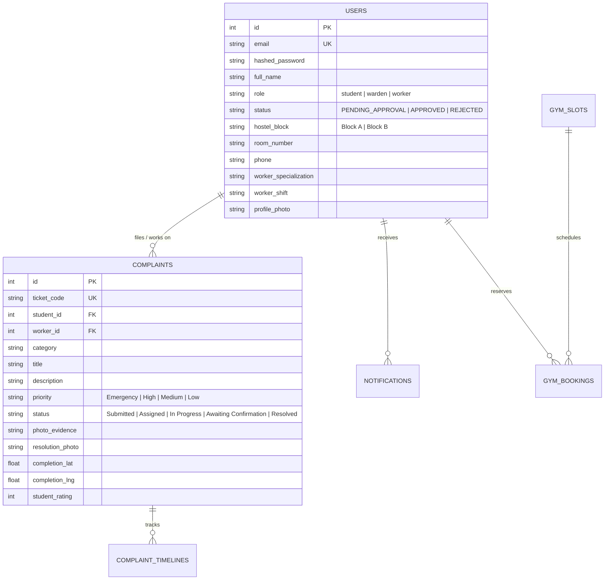

# 🏛️ ASU HostelCare — Full-Stack University Hostel Complaint & Facility Management System

**ASU HostelCare** is a production-grade, full-stack hostel grievance and residential living management portal custom-built for **Apeejay Stya University (ASU)**. It connects three distinct university stakeholders (**Resident Students**, **Hostel Warden / Super-Admin**, and **Maintenance Tradespersons / Staff**).

The system incorporates an original **Classical Academic Design Aesthetic** (Deep Navy `#050a12`, Antique Brass Gold `#c59b27`, and Oxblood Maroon `#5c1421`), AI-driven grievance triage, Ola/Rapido-style smart tradesperson dispatch, mandatory GPS-tagged photographic proof of work, student satisfaction confirmation gates, and rigorous anti-theft security shields.

---

## 🌟 What We Built & Key Architectural Highlights

### 1. 🎓 Resident Student Portal (`/student/`)
- **3-Step Registration Wizard (`register.html`)**:
  - **Step 1 (Details)**: Full student name, institutional email, mobile number with `🇮🇳 +91` prefix, Hostel Residence Block selection (**Block A** & **Block B**), room number, and dual password fields with **Interactive Eye Visibility Toggles**.
  - **Step 2 (Profile Photo)**: Live avatar photo picker with instantaneous circular preview and a *"Skip for now — I'll add one later"* option.
  - **Step 3 (Submission Status)**: Dedicated ⏳ *"Registration Submitted — Waiting for Warden Approval"* status screen.
- **Warden-Gated Admission Security**: Student accounts are created in `PENDING_APPROVAL` status. Sign-in is strictly blocked until the Warden verifies and approves the application.
- **Dual Authentication (`login.html`)**:
  - **🔑 Institutional Password Login**: Authenticated via PBKDF2-SHA256 with password visibility eye toggle.
  - **📱 Mobile OTP Verification**: 6 individual interactive numeric boxes with auto-advance, backspace auto-reverse, paste support, and a 30-second resend countdown timer.
  - *(Passwords are institutional: self-service reset is disabled to prevent account hijack; resets are handled exclusively by the Warden)*.
- **Grievance Filing with AI Assistant**:
  - Categories: *Room, Water & Electricity, Internet, Laundry, Mess, Gymnasium, Common Areas*.
  - **AI Priority Classifier**: Analyzes grievance text and predicts urgency (*Emergency, High, Medium, Low*).
  - **Duplicate Detection**: Scans existing open complaints in the same block/room to avoid redundant tickets.
- **Student Confirmation & Rating Gate**:
  - When staff marks a repair complete, ticket moves to `Awaiting Confirmation`.
  - The resident reviews the staff's **Live GPS Coordinates** and **Resolution Proof Photo**.
  - Student confirms the fix with a 1–5★ rating and remarks, or disputes/reopens the ticket if unresolved.
- **Personalized Profile Hub (`/student/profile.html`)**: Live profile photo updater, editable phone, room, and permanent address.
- **Campus Gymnasium Hub (`/student/gym.html`)**: Facility timings, active equipment catalog, etiquette rules, and 1-click gym maintenance reports.

---

### 2. 🛡️ Hostel Warden Administration (`/admin/`)
- **Super-Admin Command Center (`/admin/dashboard.html`)**:
  - Organized into **4 distinct, separated record directories**:
    1. **📋 Master Complaints Directory**: Full table of all grievances with live search, priority badges, category filters, assigned workers, and reassign modal.
    2. **👥 Registered Students Directory ("Kon Register Kiya Hai")**: Full roster of all registered students with profile photo, contact, Block A/B, room, status (`Active / Approved`, `Pending`, `Rejected`), registration date, and total complaints filed.
       - **🔍 Student Complaints History Modal**: 1-click inspection of every complaint ever filed by a specific student, along with photo proofs, ratings, and resolution notes.
    3. **⏳ Pending Admissions Approvals**: Queue of new student applicants waiting for Warden review with 1-click **Approve** and **Reject**.
    4. **👷 Maintenance Staff Roster**: Directory of active technicians, specializations, shifts, and active job loads.
- **Smart Worker Dispatch (Ola/Rapido Style Algorithm)**:
  - Recommends the best-fit tradesperson based on trade specialization matching (*Electrician for power, Plumber for sanitation, IT Technician for Wi-Fi*) and active shift workload.
- **Universal Credential Authority**:
  - Warden can reset passwords for any student or staff account with eye toggle confirmation.
- **Excel-Compatible Analytical CSV Export**:
  - Generates analytical reports with UTF-8 BOM encoding and GPS coordinates, fully compatible with Microsoft Excel.
- **Live SQL Database Inspector (`/admin/database.html`)**:
  - Browser-based relational table explorer allowing table-by-table inspection of `users`, `complaints`, `timelines`, `notifications`, `gym_slots`, and `gym_bookings` with sensitive credentials cryptographically masked.

---

### 3. 👷 Maintenance Tradespersons / Staff (`/worker/`)
- **Assigned Work Orders (`/worker/dashboard.html`)**: View active work orders filtered by status (*Assigned, In Progress, Awaiting Confirmation, Resolved*).
- **Active Job Lifecycle**:
  - **Start Job**: Transitions ticket to `In Progress` and notifies the resident.
  - **Mark Complete**: Enforces **Live Browser GPS Lock (`navigator.geolocation`)** and **Photo Proof Upload** before notifying the student for final sign-off.

---

### 4. 🌐 Public Grievance Tracker (`/track.html` & Landing Page)
- **Zero-Login Ticket Tracking**: Anyone with a complaint ticket code (e.g. `ASU-2026-1024`) can track live status without signing in.
- **Deep-Link Auto-Search**: Direct links like `/track.html?code=ASU-2026-1024` load ticket progress, photo evidence, and audit logs immediately.
- **Official University Footer**: Contains direct links to Apeejay Stya University's official portal, Instagram, YouTube, Facebook, and campus address.

---

## 🔒 Enterprise Multi-Layer Security Architecture

Built specifically to solve and prevent past vulnerabilities (e.g. source code scraping or unauthorized zip downloads):

1. **Anti-Download Source-Shield Middleware (`backend/main.py`)**:
   - Explicitly intercepts and blocks any attempt to download or access `.py`, `.env`, `.db`, `.sqlite`, `.sql`, `.zip`, `.tar`, `.gz`, `.bak`, `.log`, `.yaml`, `.sh`, `.bat`, `requirements.txt`, `/backend/`, or `/.git/` with an immediate **`HTTP 403 Forbidden`**.
2. **Server Static Isolation**:
   - Only the `/frontend` directory is mounted for static file delivery. Python source files and databases are completely excluded from static routes.
3. **Magic-Byte Image Upload Hardening (`backend/uploads.py`)**:
   - 5MB strict size limit.
   - Whitelist extension and MIME verification.
   - **Pillow Magic-Byte Inspection (`Image.open`)**: Inspects binary headers to reject disguised executables, web-shells (`.php`), or malware disguised as photos.
   - Uploads are assigned randomized 32-character UUID filenames (`uuid4().hex`) and served with `X-Content-Type-Options: nosniff`.
4. **Client-Side Anti-Inspect Protection (`frontend/js/protect.js`)**:
   - Disables right-click context menu.
   - Blocks DevTools shortcuts (`F12`, `Ctrl+Shift+I`, `Ctrl+Shift+J`, `Ctrl+Shift+C`, `Ctrl+U`, `Ctrl+S`).
5. **Web Server Hardening**:
   - **Apache / cPanel ([`.htaccess`](file:///c:/Users/shubh/OneDrive/Desktop/NEW/.htaccess))**: Disables directory listing (`Options -Indexes`) and blocks archive files.
   - **Nginx ([`nginx_security.conf`](file:///c:/Users/shubh/OneDrive/Desktop/NEW/nginx_security.conf))**: Reverse proxy configuration blocking dotfiles and sensitive paths.
6. **Tiered Rate Limiter (`backend/rate_limiter.py`)**:
   - Monitored by client IP and account email. Consecutive failed attempts trigger exponential backoff delays with `HTTP 429` and `Retry-After` headers.
7. **SQL Injection Immunity**:
   - Pure SQLAlchemy ORM parameterized queries; raw string SQL queries are strictly forbidden.
8. **Cryptographic Authentication**:
   - Passwords hashed with PBKDF2-SHA256 using random salts.
   - Sessions managed via cryptographic JWT tokens (HMAC-SHA256) with role validation on every endpoint.

---

## 🛠️ Technology Stack

| Layer | Technologies Used |
| :--- | :--- |
| **Backend** | Python 3.11, FastAPI, SQLAlchemy ORM, Uvicorn, Pydantic v2 |
| **Database** | SQLite (Default, zero-configuration) / Postgres / MySQL ready |
| **Security & Auth** | JWT (PyJWT), PBKDF2-SHA256 (Passlib), Pillow (Magic-Byte analysis), Python Rate Limiter |
| **Frontend** | Pure Semantic HTML5, Vanilla CSS3 (Custom Design System), Vanilla JavaScript (ES6+) |
| **Design Language** | Classical Academic Theme (Cinzel, Playfair Display, Inter, Gold Accents, Dark Glassmorphism) |
| **Deployment** | Docker, Docker-Compose, Gunicorn/Uvicorn, Render (`render.yaml`), Railway, cPanel (`.htaccess`), Nginx |

---

## 🗄️ Database Schema Overview



---

## 🚀 How to Run Locally

### 1. Install Dependencies
```bash
pip install -r requirements.txt
```

### 2. Launch the Application
```bash
python main.py
# Or using uvicorn directly:
python -m uvicorn backend.main:app --host 127.0.0.1 --port 8000 --reload
```

### 3. Portal Access URLs
- **Homepage & Public Tracker**: [http://127.0.0.1:8000/](http://127.0.0.1:8000/)
- **Portal Sign In**: [http://127.0.0.1:8000/login.html](http://127.0.0.1:8000/login.html)
- **Student Registration**: [http://127.0.0.1:8000/register.html](http://127.0.0.1:8000/register.html)
- **Public Complaint Tracker**: [http://127.0.0.1:8000/track.html](http://127.0.0.1:8000/track.html)

---

## 👥 Seeded Default Accounts (For Evaluation)

| Role | Email | Password | Permissions & Features |
| :--- | :--- | :--- | :--- |
| **Warden (Super Admin)** | `admin@asu.edu` | `admin123` | Admissions review, smart dispatch, password override, database inspector |
| **Electrician (Worker)** | `electrician@asu.edu` | `worker123` | Electrical repairs, GPS proof upload, job lifecycle |
| **Plumber (Worker)** | `plumber@asu.edu` | `worker123` | Water & sanitary repairs, GPS proof upload |
| **Student** | Apply via [Registration](http://127.0.0.1:8000/register.html) | Created at signup | Grievance filing, proof review, 5★ sign-off |
